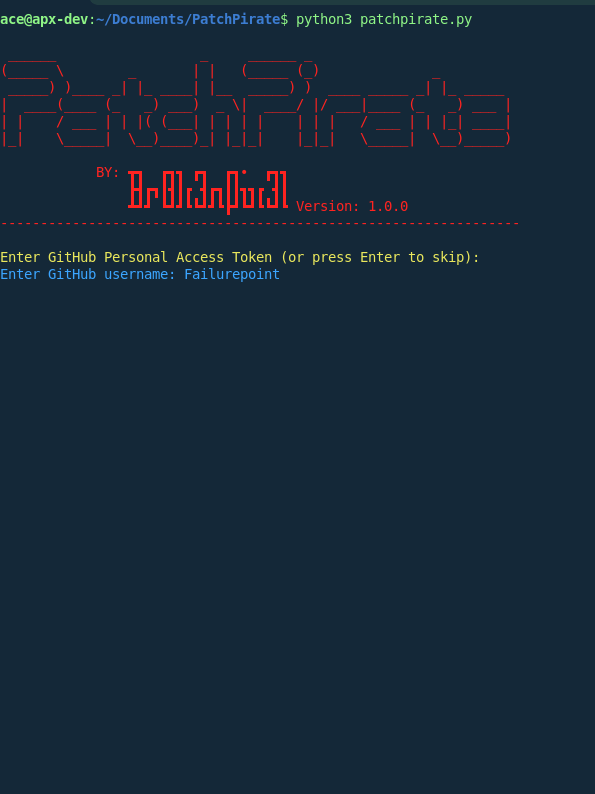
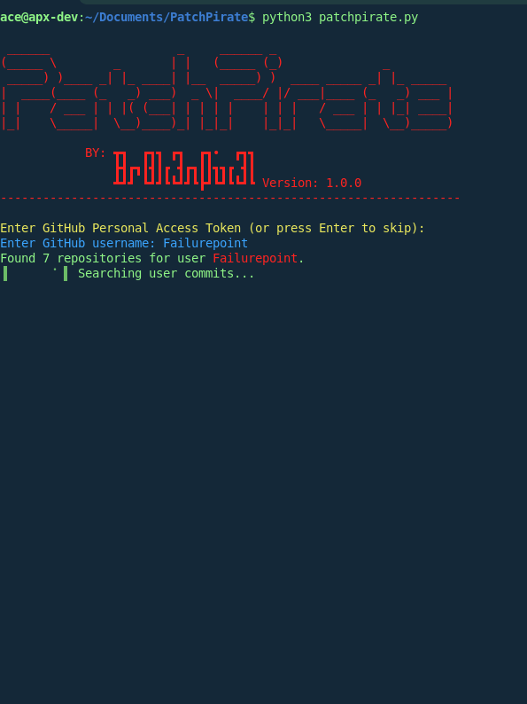
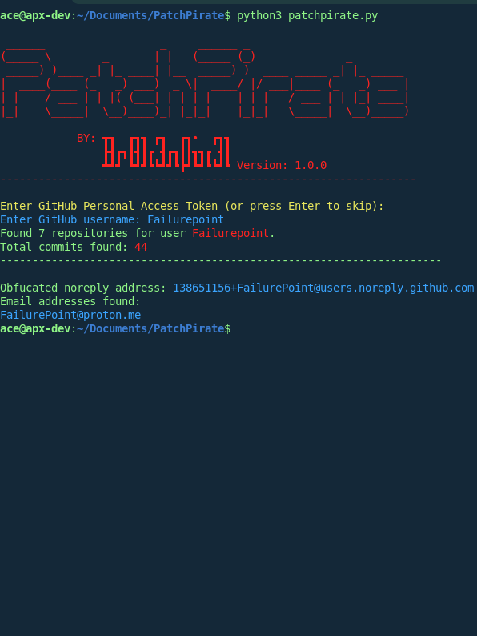

# 🏴‍☠️ PatchPirate

   [](https://www.python.org/)
   [](https://docs.github.com/en/rest)
   [](LICENSE)

PatchPirate is a focused Recon/OSINT utility built to mass-process public GitHub commit and repository data and identify unintentionally exposed personal email addresses linked to a target GitHub username or account.

---

## 🚀 Installation

### Prerequisites
* **Python 3.11+**
* **pip** (Python package installer)

### Quick Setup (Linux/macOS)
Run the following command to clone and install:

```bash
git clone [https://github.com/FailurePoint/PatchPirate.git](https://github.com/FailurePoint/PatchPirate.git) && cd PatchPirate && python3 -m pip install -r requirements.txt
```

## 🏃‍♂️‍➡️ Running the App
Once installed, execute the script directly from your terminal: `cd PatchPirate && python3 patchpirate.py`

## ⚙️ Configuration
You can tweak the tool's behavior by modifying the configuration file. Below is the standard setup structure:
```TOML
GitHub Personal Access Token (required for larger profiles, uncomment to use)
# GITHUB_TOKEN = ghp_XXXXXXXXXXXXXXXXXXXXXXXXXXXX

# Disable lookups for associated profiles and profile photos (True to disable)
DISABLE_LOOKUPS = False

# Disable profile information panel (True to disable)
DISABLE_PROFILE_INFO = False
```

## 💡 Usage & Rate Limits: 
Usage is self-obvious... please don't ask how to use it. Just use your brain for 30 seconds. It's really not that hard.The API BottleneckGitHub enforces a strict rate limit of 60 requests per hour for unauthenticated users. A scan's footprint varies depending on how many public repositories the target account maintains. If the target has a significant history, 60 requests may not be enough. In that case you can generate a Personal Access Token (PAT) from your GitHub account settings and add it to your configuration. This raises your limit to 5,000 requests per hour. Need help generating one? Check out [this](https://www.geeksforgeeks.org/git/how-to-generate-personal-access-token-in-github/) guide.

## 📸 Screenshots




